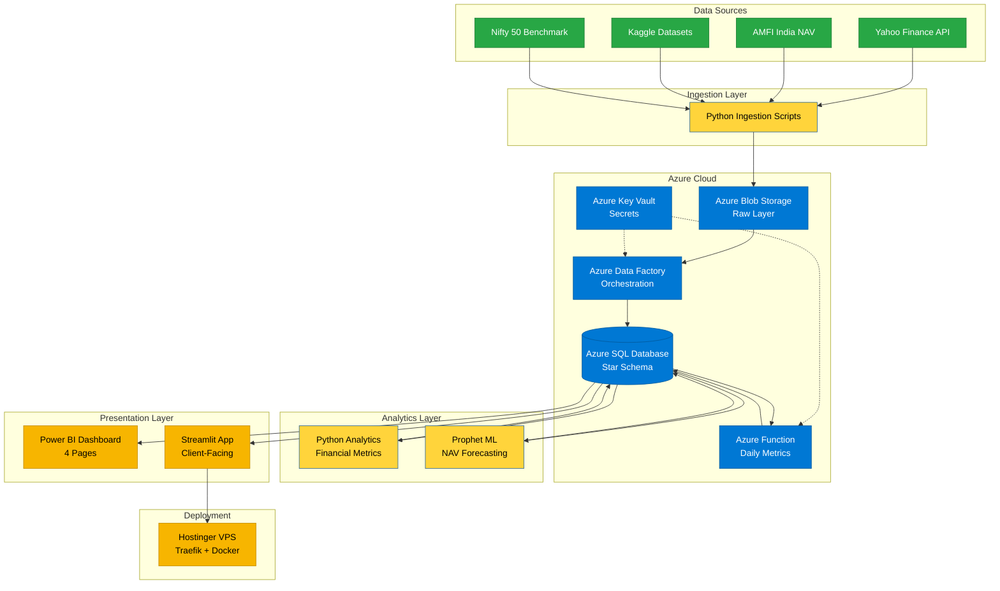

# 🏗️ Architecture — Mutual Fund Analytics Platform

## High-Level Architecture (Mermaid)

---

## Component Detail

### 1. Data Sources
| Source | Data | Frequency | Format |
|---|---|---|---|
| Yahoo Finance API | NAV history, Nifty 50 | Daily | JSON via API |
| AMFI India | Official Indian MF NAV | Daily | TXT scrape |
| Kaggle | Investor transactions, SIP data | One-time | CSV |
| NSE Bhavcopy | Benchmark indices | Daily | CSV |

### 2. Ingestion Layer
- **Tech:** Python (requests, pandas, BeautifulSoup)
- **Pattern:** Idempotent fetchers with date partitioning
- **Output:** Parquet files to `data/raw/` and Azure Blob `raw/` container

### 3. Storage Layer (Azure Blob)
- **Container:** `raw/` (immutable raw data)
- **Container:** `processed/` (cleaned, validated)
- **Container:** `archive/` (post-load archived data)
- **Retention:** 90 days hot, then cool tier

### 4. Orchestration (Azure Data Factory)
- **Pipeline 1:** `pl_raw_to_sql` — Blob → SQL DB (Copy Activity)
- **Pipeline 2:** `pl_transform_facts` — runs transformation stored procs
- **Trigger:** Schedule trigger (daily 6 AM IST)
- **Monitoring:** Alert on pipeline failure → email

### 5. Data Warehouse (Azure SQL DB)
- **Schema:** Star schema (Kimball-style)
- **Fact Tables:** `Fact_NAV`, `Fact_Transactions`, `Fact_SIP`, `Fact_Returns`
- **Dimension Tables:** `Dim_Fund`, `Dim_Date`, `Dim_Investor`, `Dim_AMC`, `Dim_Category`
- **Tier:** Basic (sufficient for free trial, ~₹400/mo equivalent)
- **Indexes:** Clustered on date keys, non-clustered on dimension foreign keys

### 6. Compute (Azure Function)
- **Trigger:** HTTP + Scheduled (daily 7 AM)
- **Runtime:** Python 3.11
- **Function:** `fn_compute_daily_metrics` — recomputes Sharpe, Alpha, Beta nightly
- **Output:** Writes to `Fact_Returns` aggregated table

### 7. Security (Azure Key Vault)
- Stores: SQL connection strings, API keys, storage account keys
- Access: Managed Identity from ADF, Functions
- No secrets in code or repo

### 8. Analytics Layer (Python)
- **Modules:** `metrics_returns.py`, `metrics_risk.py`, `metrics_risk_adjusted.py`, `metrics_market.py`
- **Libraries:** numpy, pandas, scipy, statsmodels

### 9. ML Layer (Prophet)
- **Model:** Facebook Prophet (additive, with yearly seasonality)
- **Training:** Top 10 funds by AUM
- **Horizon:** 30/60/90 day NAV forecasts
- **Confidence intervals:** 80% and 95%
- **Storage:** Pickled models in Blob

### 10. BI Layer (Power BI)
- **Mode:** Import mode (refreshed nightly)
- **Pages:** 4 (Executive, Performance, Investor, Risk)
- **Measures:** 20+ DAX measures
- **Distribution:** Power BI Service workspace (during free trial), PBIX file post-trial

### 11. Application Layer (Streamlit)
- **Framework:** Streamlit 1.30+
- **Data source (primary):** Local PostgreSQL on VPS
- **Data source (Azure window):** Azure SQL DB via pyodbc
- **Pages:** 4 (SIP Planner, Fund Comparison, Risk Profiler, NAV Forecast)
- **Deployment:** Hostinger VPS, Docker + Traefik, SSL via Let's Encrypt

---

## Data Flow

1. **05:00 IST** — Python ingestion scripts pull from Yahoo Finance, AMFI
2. **05:30 IST** — Raw data uploaded to Azure Blob `raw/`
3. **06:00 IST** — ADF pipeline `pl_raw_to_sql` triggered
4. **06:15 IST** — ADF pipeline `pl_transform_facts` runs transformations
5. **07:00 IST** — Azure Function `fn_compute_daily_metrics` recomputes metrics
6. **07:30 IST** — Power BI scheduled refresh
7. **08:00 IST** — Dashboard live, clients see updated data via Streamlit

---

## Decisions & Trade-offs

| Decision | Why | Trade-off |
|---|---|---|
| Azure SQL DB Basic tier | Free trial budget | Slow on large queries; mitigated by indexes |
| Prophet over LSTM | Lower compute, interpretable | Less accurate for nonlinear shocks |
| Import mode in Power BI (not DirectQuery) | Faster dashboards | Requires nightly refresh |
| Streamlit over Dash | Faster dev, simpler | Less customizable |
| PostgreSQL fallback | Azure trial expires in 15 days | Duplicate data layer to maintain |
| Hostinger VPS over Azure App Service | Already paid for, no extra cost | Manual deployment |

---

## Scalability Notes

- **Current scale:** 30 funds × 5 years × daily NAV = ~55,000 rows in Fact_NAV
- **Production scale (theoretical):** 2,000+ funds × 10 years = ~7M rows
- **Bottlenecks expected at production scale:**
  - Power BI Import mode → switch to DirectQuery or aggregations
  - Daily full refresh → switch to incremental refresh
  - SQL Basic tier → upgrade to Standard or Premium
  - Prophet training → batch with Azure Batch or Databricks

---

## Future Enhancements (Out of MVP Scope)

- Monte Carlo simulation for portfolio risk
- Efficient Frontier optimization
- Row-Level Security (Power BI Pro)
- Investor churn ML model
- Real-time NAV streaming via Event Hubs
- Mobile app (React Native + same SQL backend)
